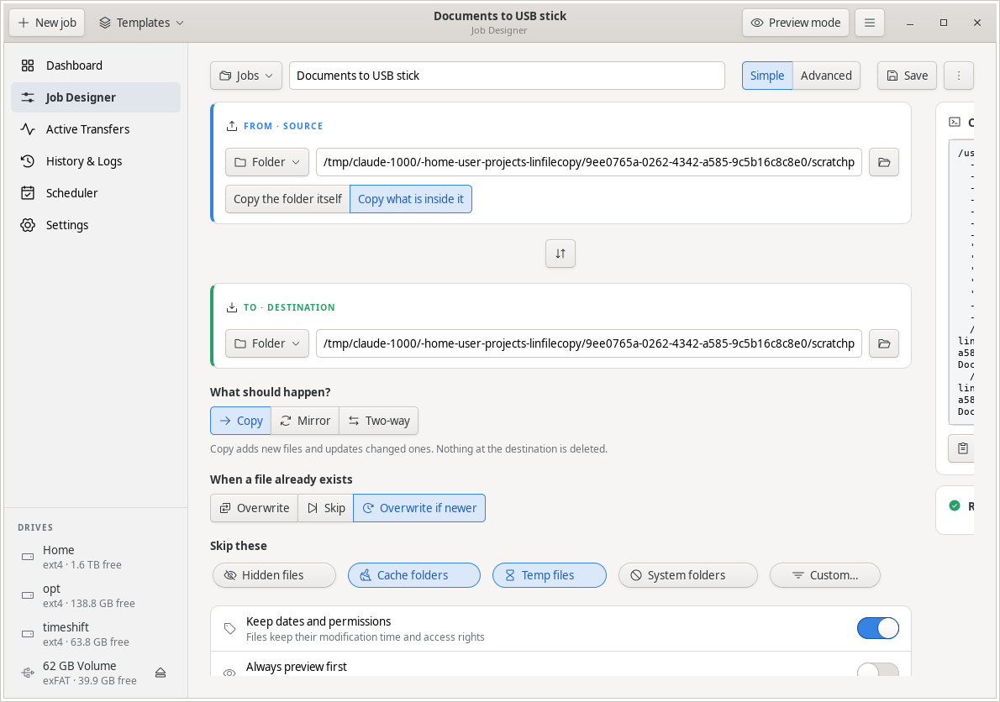
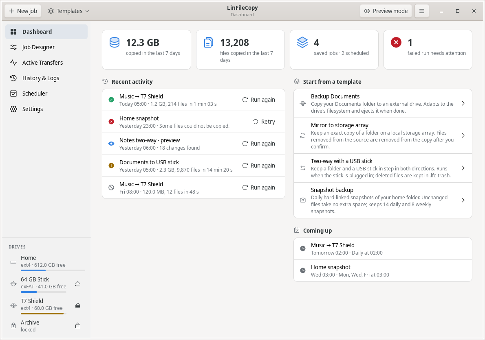
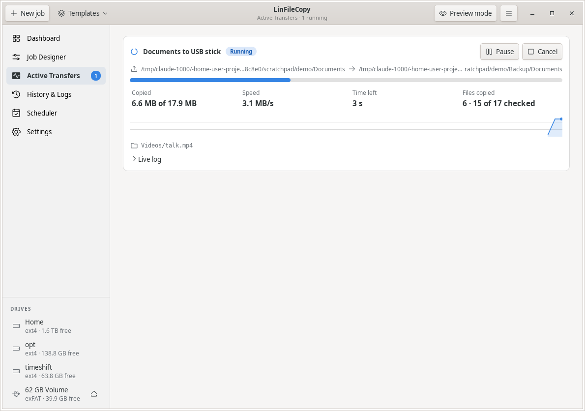
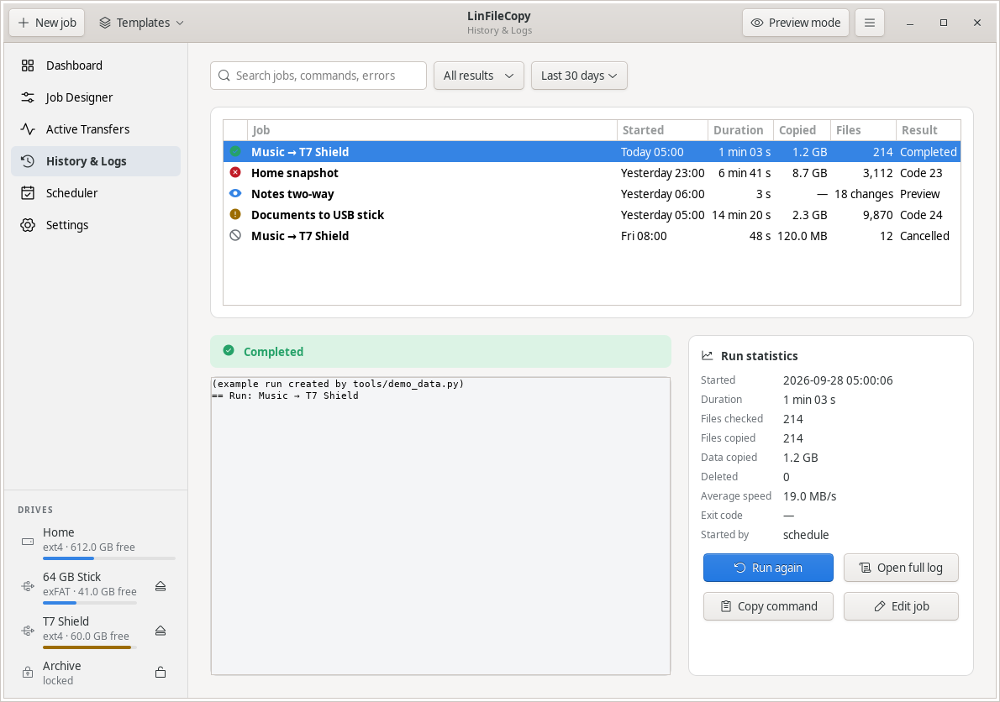
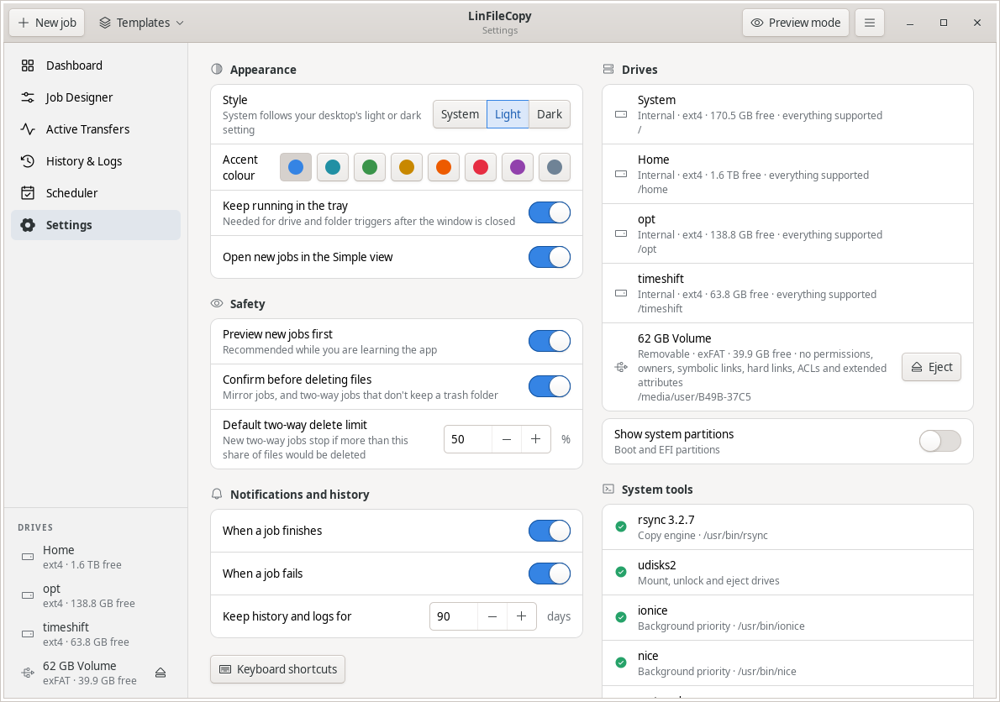
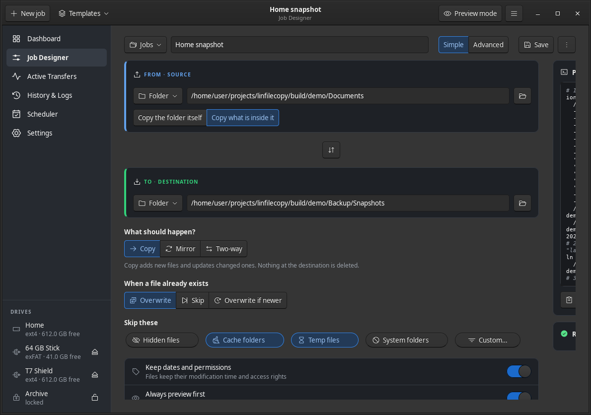

# LinFileCopy

A native GTK 3 desktop app for copying and syncing folders between **local disks, USB
sticks, external drives and local storage arrays**, powered by **rsync**.

You design a job with a clear form, preview exactly what will change, run it, watch live
progress and get a notification when it finishes. You never have to type an rsync command,
but the exact command is always shown and can be copied.



- **Local storage only.** There is no cloud or network code.
- **No external runtime dependencies.** The app uses the Python standard library, PyGObject
  and system tools. All icons are embedded (Phosphor, MIT).

## Features

| | Basic (Simple view) | |
|---|---|---|
| B1 | Source & destination | Drive picker, folder browser, drag and drop, swap |
| B2 | Copy / Mirror / Two-way | Mirror always confirms deletions with the exact list |
| B3 | Live progress | Bar, speed, time left, files, current file, speed graph |
| B4 | Start / Pause / Cancel | Pause stops rsync's whole process group; Cancel asks first |
| B5 | Keep dates & permissions | Adjusted automatically for exFAT/FAT/NTFS drives |
| B6 | Skip common items | Hidden files, caches, temp files, system folders, custom rules |
| B7 | Preview | Dry run with a filterable list of new/updated/deleted files |
| B8 | History | Every run with statistics, log, exact command and one-click re-run |
| B9 | Existing files | Overwrite / Skip / Overwrite if newer |
| B10 | Notifications | Desktop notification on success or failure, with Retry and Open log |

| # | Advanced (Advanced view) | rsync / implementation |
|---|---|---|
| 1 | Delta transfer, update in place | `--no-whole-file`, `--inplace` |
| 2 | Compare by size+time or size only | default / `--size-only` |
| 3 | Permissions, times, owner, group, ACLs, xattrs, hard links, devices, symlink policy | `-p -t -o -g -A -X -H -D`, `-l`/`-L` |
| 4 | Dry run / global preview mode | `--dry-run --itemize-changes` |
| 5 | Ordered include/exclude rules, exclude-from, files-from, filter test | `--include/--exclude/--exclude-from/--files-from` |
| 6 | Speed limit and background priority | `--bwlimit`, `ionice -c3 nice -n19` |
| 7 | Resume interrupted files | `--partial --partial-dir=.lfc-partial` |
| 8 | Checksum verification | `-c` |
| 9 | ~~Compression~~ | removed: rsync does not compress local copies |
| 10 | Encrypted (LUKS) drives | Unlock/lock through UDisks2, optional keyring |
| 11 | Progress & statistics | Parsed `progress2` / `stats2` |
| 12 | Parallel streams | Balanced buckets → N rsync processes |
| 13 | Two-way sync | Native: state file, conflict policies, `.lfc-trash`, delete guard |
| 14 | Run when files change | inotify (ctypes), debounced |
| 15 | Sparse files | `-S` |
| 16 | Atomic replace | Hard-link staging copy + `renameat2(RENAME_EXCHANGE)` |
| 17 | Hard-linked snapshots | `--link-dest`, `latest` link, daily/weekly retention |
| 18 | Logging, exit codes, retries | Plain-language errors with fixes, retry with backoff |
| 19 | Scheduling | systemd user timers or cron; also "when drive connected" |
| 20 | Drive-aware endpoints | Drives found by UUID, filesystem limits, free space, eject |

## Requirements

- Linux with GTK 3.24
- Python 3.10 or newer, with PyGObject
- rsync 3.1 or newer
- Recommended: UDisks2 (mount, unlock, eject), `ionice`, systemd user session or `crontab`
- Optional: Ayatana AppIndicator (tray icon), libsecret (remember drive passphrases)

Debian / Ubuntu:

```sh
sudo apt install python3-gi gir1.2-gtk-3.0 rsync udisks2 \
                 gir1.2-ayatanaappindicator3-0.1 gir1.2-secret-1
```

Fedora: `sudo dnf install python3-gobject gtk3 rsync udisks2 libayatana-appindicator-gtk3 libsecret`

Arch: `sudo pacman -S python-gobject gtk3 rsync udisks2 libayatana-appindicator libsecret`

## Install

Debian, Ubuntu and derivatives: the repository includes a ready-made package.

```sh
git clone https://github.com/MensuraMedia/linfilecopy.git
cd linfilecopy
./install.sh            # checks releases/SHA256SUMS, then: sudo apt install ./releases/linfilecopy_*_all.deb
```

Any distribution, without root (installs into `~/.local`):

```sh
./install.sh --check    # lists missing system packages and how to install them
./install.sh --user     # app in ~/.local/share/linfilecopy, launcher in ~/.local/bin, menu entry and icons
./install.sh --uninstall   # removes the --user install; your jobs and history are kept
./install.sh --dev      # menu entry "LinFileCopy (development)" that runs this checkout directly
```

To run straight from the checkout without installing: `python3 -m linfilecopy`.

Rebuild the package with `tools/build_deb.sh`. Debian source packaging is in
[`packaging/debian`](packaging/debian), and a Flatpak manifest is in [`packaging/flatpak`](packaging/flatpak).

## Usage

1. **Quick View:** every job with its source → destination and when it runs. **Run now** starts
   it (with the usual preview and delete confirmation) and shows a live progress bar.
2. **Job Designer:** pick the source and destination. Use the drive button, Browse, or drag
   a folder from your file manager. Then choose Copy, Mirror or Two-way.
2. The panel on the right shows the exact command and any problems, each with a suggested fix.
3. **Preview** lists every change. **Start** runs the job (with a preview first, if that is on).
4. **Active Transfers** shows live progress. Pause or cancel with the buttons, or with Space and Esc.
5. **History & Logs** lists every run. Select a failed run to see what went wrong and retry it.
6. **Scheduler** installs a systemd timer or cron entry. Timed runs use the headless command.

### Headless command

```sh
linfilecopy list                      # saved jobs and their schedules
linfilecopy validate <job-id>         # check a job, print its plan
linfilecopy preview  <job-id>         # list what would change
linfilecopy run      <job-id>         # run (exit 0 ok, 1 failed, 3 cancelled, 4 warnings)
```

### Keyboard shortcuts

Ctrl+N new job · Ctrl+S save · Ctrl+Return start · Ctrl+Shift+P preview · Ctrl+Shift+C copy
command · Ctrl+E eject · Ctrl+1…7 pages · Space / Esc pause / cancel (Transfers) · Ctrl+? all
shortcuts

### Where things are stored

| | |
|---|---|
| Jobs | `~/.config/linfilecopy/jobs/<id>.json` |
| Settings | `~/.config/linfilecopy/settings.json` |
| History | `~/.local/share/linfilecopy/history.db` |
| Two-way state | `~/.local/share/linfilecopy/state/<id>.sqlite` |
| Run logs | `~/.local/state/linfilecopy/logs/` |
| Schedules | `~/.config/systemd/user/linfilecopy-<id>.{service,timer}` or your crontab |

Example job files are in [`docs/examples/`](docs/examples/). Import them from the designer's ⋮ menu.

## Screenshots

| | |
|---|---|
|  |  |
|  |  |
|  | |

## Documentation

- [Technical concept](docs/CONCEPT.md): design, build order, feature → flag mapping
- [Architecture (as built)](docs/ARCHITECTURE.md)
- [Developer guide](docs/DEVELOPER.md)
- [Mockups](docs/mockups/index.html): the design-stage record (open in a browser; self-contained)
- [Releases](releases/README.md): the Debian package and its checksum
- [GTK dashboard template](https://github.com/MensuraMedia/gtk4-dashboard-template): this app's dashboard shell as a
  reusable template, with full documentation and an AI instruction set

## Licence

GPL-3.0-or-later. Icons: [Phosphor Icons](https://phosphoricons.com) v2.0.8, MIT.
